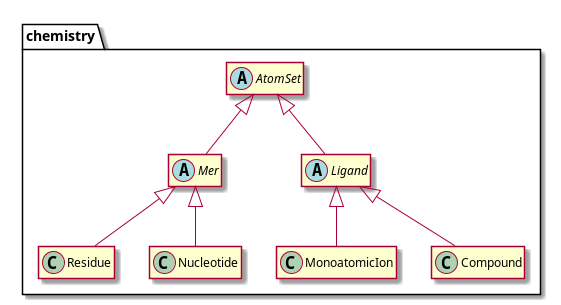

# PyDesc cookbook

<!--

Add sections using template below.
After adding section -- run md_toc and paste result as TOC.

examples that are to be tested place in "```python <code> "
examples that should not be tested by pytest -- in " ```python <code>" (note space at
 start).

==== TEMPLATE

    ## Template

    Description

    ### Configuration

    There is no related configuration.

    ### API

    TBD

    ### Simple usage

    TBD

    ### There is more 

    TBD

==== TEMPLATE END
-->

  - [Configuration](#configuration)
  - [Loading structures](#loading-structures)
    - [Configuration](#configuration-1)
    - [API](#api)
    - [Simple usage](#simple-usage)
    - [Better control over loading](#better-control-over-loading)
    - [Structure file handlers](#structure-file-handlers)
    - [File parsers](#file-parsers)
    - [Number converters](#number-converters)
  - [AtomSet - structure building block](#atomset---structure-building-block)
    - [Configuration](#configuration-2)
    - [API](#api-1)
    - [Simple usage (AtomSet trivia)](#simple-usage-atomset-trivia)
    - [AtomSet factories](#atomset-factories)
    - [Full-atom representation](#full-atom-representation)
    - [Martini](#martini)
    - [User defined representation](#user-defined-representation)
  - [Substructures](#substructures)
    - [Configuration](#configuration-3)
    - [API](#api-2)
    - [Simple usage](#simple-usage-1)
    - [Descriptors](#descriptors)
  - [Trajectories](#trajectories)
    - [Configuration](#configuration-4)
    - [API](#api-3)
    - [Simple usage](#simple-usage-2)
  - [Selections](#selections)
  - [Contact maps](#contact-maps)
    - [Configuration](#configuration-5)
    - [API](#api-4)
    - [Simple usage](#simple-usage-3)
    - [Changing contact criteria](#changing-contact-criteria)
    - [Contact maps for substructures](#contact-maps-for-substructures)
    - [Contacts between two substructures](#contacts-between-two-substructures)
  - [Frequency maps](#frequency-maps)
    - [Configuration](#configuration-6)
    - [API](#api-5)
    - [Simple usage](#simple-usage-4)
  - [Contact Criteria](#contact-criteria)
    - [Pre-defined criteria](#pre-defined-criteria)
    - [Customizing criteria](#customizing-criteria)
  - [Structure comparison](#structure-comparison)
    - [Overfit](#overfit)
    - [Compdesc](#compdesc)
    - [FitDesc](#fitdesc)
  - [Alignments](#alignments)
  - [Integration with PyMOL](#integration-with-pymol)
    - [Integrating PyMOL with PyDesc](#integrating-pymol-with-pydesc)
    - [Configuration](#configuration-7)
    - [API](#api-6)
  - [Geometry](#geometry)

## Configuration

TBD

## Loading structures

Basis for any study one can perform using PyDesc is loading structure.

### Configuration

```python
from pydesc.config import ConfigManager
import pydesc.chemistry
import pydesc.dbhandler

ConfigManager.dbhandler.cachedir
ConfigManager.dbhandler.pdb_handler
ConfigManager.chemistry.solvent

```

* `cachedir` -- path to directory where downloaded structure files are stored.
* `pdb_handler` -- path to local copy of PDB.
* `solvent` -- list of strings (particle names) to be skipped while loading file.

### API

Api for structure loading is available as module `pydesc.api.structure` and contains two
 functions:
```python
from pydesc.api.structure import get_structures
from pydesc.api.structure import get_structures_from_file

structures = get_structures("1no5")

re_loaded_structures = get_structures_from_file("./biodb/pdb/no/1no5.pdb")
```
`get_structures` takes structure id (for PDB, CATH, SCOP or BioUnit) as string and
 returns list of structure, if it was possible to get to the file.
 It first tries to load local copy from cache dir, then it tries to download it (and
 store in cache dir).
 It returns a list with as many structures, as many models there were in the file.
 It is often just one, but for NMR or trajectories its longer.
 
To learn mora about trajectories see also [this section](#trajectories).
 
`get_structure_from_file` also loads list of structure, but from single file, not
 necessarily from cache dir. In this case also it can be file in PDB or mmCIF format.

### Simple usage

To quickly load structure and be able to read and edit it, simply run:

```python
from pydesc.structure import StructureLoader

structure_loader = StructureLoader()
models_list = structure_loader.load_structures('1no5')
structure = models_list[0]  # if there is more than one model in pdb file
                            # they are stored in resulting list

for atom_set in structure:
    print(atom_set)          # residues, nucleotides or others (ions or ligands)
    for atom in atom_set.atoms:
        print(atom)

```

### Better control over loading

To gain more control over process of loading structure, note that there are details
that could be changed. Lets take a look on the example (explained below):

```python
from pydesc import dbhandler
from pydesc.chemistry import factories as as_factories
from pydesc.structure import StructureLoader


db_handler = dbhandler.MetaHandler(mode=(3, 2, 1))
file_parser = dbhandler.MetaParser(QUIET=True)
as_factory = as_factories.BioPythonAtomSetFactory()

structure_loader = StructureLoader(
    handler=db_handler,
    parser=file_parser,
    atom_set_factory=as_factory,
    )

models_db = structure_loader.load_structures(code="1no5")  # download from db
models_hd = structure_loader.load_structures(path='tests/data/dbtest/PDB/1nkl')
                                                           # download from hard drive

```

`db_handler = dbhandler.MetaHandler(mode=(3, 2, 1))`
Handlers are objects responsible for handling structure files.
There is at least one for each data base.
Meta handler contains them all.
Learn more [here](#structure-file-handlers).

`file_parser = dbhandler.MetaParser()`
Pydesc uses external file parsers, e.g. from BioPython and MDTraj.
MetaParser consists of PDBParser and mmCIFParser and executes both on given input.
Learn more [here](#file-parsers)

`as_factory = as_factories.BioPythonAtomSetFactory()`
AtomSet factory is object responsible for creation of structures building blocks.
Its settings are important whenever one needs to change way of how and which types of
 AtomSets are created.
Learn more [here](#atomset-factories).
 
`models_db = structure_loader.load_structures(code="1no5")`
That line loads structure using file handler.
Argument `code` is passed to handler, so it can be any string comprehensive for such 
 object, e.g. "cath://1no5" for MetaHandler or "bio://1no5/1" for BioUnitHandler.
Learn more [here](#structure-file-handlers).

`models_hd = structure_loader.load_structures(path='tests/data/dbtest/PDB/1nkl')`
This command loads file form hard drive. Handler is surpassed, file content is given
 directly to parser.

### Structure file handlers

Handlers are objects responsible for handling structure files.
There is at least one for each data base.
Meta handler contains them all.
Handlers store downloaded files in local cache.
Therefor users can set their behaviour by setting modes and their priorities:
* in mode 3 handler reads local cache
* in mode 2 handler copies file from local db to local cache (overwrite)
* in mode 1 handler downloads file from remote db to local cache (overwrite)
Handler tries to get files in different modes 

### File parsers

PyDesc does not provide any structure file parser itself.
Instead it uses BioPython parsers to read `.pdb` and `.cif` files and MDTraj parsers
to read different trajectories.
`StructureLoader` can accept:
* BioPython's PDBParser
* BioPython's MMCIFParser
* PyDesc's MetaParser
* any object with method and signature such as: `get_structure(code: str, file_path: 
str)`

### Number converters

TBD

## AtomSet - structure building block

`AtomSet` is a base class for objects representing mer of biopolymers and other
 chemical entities that occur during structure or trajectory analysis.
 In Pydesc each structure comprises some instances of `AtomSet` subclasses.
 There are two important ones:
 * `Mer` -- representing parts of biopolymers like residues or nucleotides.
 * `Ligand` -- all other particles.
 Both of them are abstract as well, which means there are other subclasses inheriting
 from them.



PyDesc provides some classes representing sets of atom in full-atom representation.
 Those will be described as an example.
 Other representations require separate implementation.
 Some basic coarse-grain representation are also implemented.
 Browse through `pydesc.chemistry` module to learn more.
 This section covers common features of `AtomSet` subclasses and how to implement own
  subclasses.

### Configuration

TBD

### API

Right now api related to this section is limited to single convenience function for
 full-atom residues:
```python
from pydesc.api.full_atom import calculate_residues_angles
from pydesc.api.structure import get_structures

structure = get_structures("2bll")[0]
mer1 = structure[0]
mer2 = structure[1]
print(mer1.dynamic_features)
print(mer1.angles)
print(mer1.dynamic_features)
calculate_residues_angles(structure)
print(mer2.dynamic_features)
```
Angles are stored in dictionary `dynamic_features`, but calculation is lazy
, performed only when one tries to get `angles` attribute.
It is suboptimal to call the same algorithm on each particular residue, much faster
 method (vectorized) is invoked by function `calculate_residues_angles`, that takes
 structure as argument.
 It sets angles for all full-atom residues in given structure, even if attribute
 `angles` aws not accessed (like in case of `mer2` and all subsequent residues).

### Simple usage (AtomSet trivia)

`AtomSet` instances are iterable.
 Basic iterator iterates over atoms, returns `Atom` instances.
 They store data typical for `.pdb` file and inherit methods from `Coord` class
 , which is basically vectors:
```python
from pydesc.api.structure import get_structures

structure = get_structures("1no5")[0]

first_residue = structure[0]

for atom in first_residue:
    print(atom.element, atom.vector, atom.occupancy, atom.b_factor)

atom1, atom2, *_ = tuple(first_residue)

vector_a1_a2 = atom1 - atom2
distance_a1_a2 = vector_a1_a2.calculate_length()
direction = vector_a1_a2.get_unit_vector()
```
Another way to get atoms from `AtomSet` instance is by its name:
```python
from pydesc.api.structure import get_structures

structure = get_structures("1no5")[0]

first_residue = structure[0]
ca_atom = first_residue.atoms["CA"]
cb_atom = first_residue.atoms["CB"]
```
Beside atoms, `AtomSet` instances can also store pseudoatoms.
Any type will have geometrical center for sure.
```python
from pydesc.api.structure import get_structures

structure = get_structures("1no5")[0]

residue = structure[0]
ion = structure[100]
compound = structure[105]

for atoms in (residue, ion, compound):
    print(atoms.gc)
```
Pseudoatoms are calculated dynamically and cached when accessed first time.
 Each `AtomSet`, beside pseudoatoms available in `pseudoatoms` attribute, stores also
 `dynamic_features`, which are also calculated dynamically and represents all sort of
 features that can be calculated for set of mers, but are not pseudoatoms, like base
 planes or torsion angles.
 Bear that in mind when working with trajectories (changing frames resets cache!).

Distinguish between backbone and side chain atoms for mers leads us to additional
 iterators in `Mer` subclasses:
```python
from pydesc.api.structure import get_structures

structure = get_structures("1no5")[0]
residue = structure[0]

if residue.is_chainable():
    print("Backbone")
    for atom in residue.iter_bb_atoms():
        print(atom)
    print("Side chain:")
    for atom in residue.iter_nbb_atoms():
        print(atom)
    print(residue.next_mer)
    print(residue.prev_mer)

```
`Mer` subclasses also return `True` when one calls `is_chainable` on them, just to
 make it easier.

If PyDesc detects chemical bound between two mers, it sets their attributes `mext_mer
` and `prev_mer` (otherwise they are set to `None`).

### AtomSet factories

While parsing a file, instances of `AtomSet` subclasses are produced by factories.
 By changing factory one might influence the way mers or ligands are created, while
 loading structure.

Structure loader parses file, then passes every item that has its own id in pdb or
 cif file to factory.
 By default factory tries to produce `Residues` or `Nucleotides` out of what it gets
 , then -- `MonoatomicIon` or `Compound`.
 PDB id "2BLL" refers to structure that comprises only residues (no ions, no other
 particles).
 Knowing that one could want to change default behaviour and set factory to produce
 Residues only:
```python
from pydesc.chemistry import factories as as_factories
from pydesc.chemistry.full_atom import Residue
from pydesc.structure import StructureLoader

classes = [Residue]

as_factory = as_factories.BioPythonAtomSetFactory(classes)

structure_loader = StructureLoader(
    atom_set_factory=as_factory,
    )

models_db = structure_loader.load_structures(code="2bll")
```

In this case factory only tries to produce `Residue` instances.
 Structure loader tries to get some kind of representation for every set of atoms
 that has id in file and raises `ValueError` if it is not possible.
 That could be the case if loaded file contained incomplete residues or something
 other than residue.
 Limiting possible types of mers speeds up structure loading, but optimization is not
 the main reason to do so.

Creating default factory is equivalent of: `BioPythonAtomSetFactory([Residue,
 Nucleotide, MonoatomicIon, Compound])`.
 All classes comes from `pydesc.chemistry.full_atom` module.
 That setting allows for successful load of almost any structure, but produces
 incorrectly classified objects, e.g. `Compound` instances out of residues that lack
 backbone atoms.
 
That leads us to actual use case for this feature: representations other than full
-atom, for example CaBS, MARTINI or C-alpha- or P-trace require change of that
 setting, otherwise structure loading gives misleading results.
 For example nucleic acids represented as P-trace are loaded as chains full of
 `MonoatomicIon` instances.

### Full-atom representation

By default PyDesc expects loaded files to store structures in full-atom representation.
 In this representation residues and nucleotides provide some features.

Residues in pydesc store pseudoatom `cbx`, which stands for "extended CB" and is
 calculated by extending vector CA->CB by 1.
 It is useful during structure comparison, as it grants extra sensitivity for
 comparison methods for secondary structure type.
 PyDesc also calculates torsion angles (as dynamic feature).
 Note that calculating them individually for each mer is not efficient, so to get all
 of them rather then values for single residues of interest use
 `calculate_residues_angles_vectorized` from `pydesc.chemistry.full_atom` module or
 even more convenient `pydesc.api.full_atom.calculate_residues_angles` function.
 Another interesting pseudoatom is moving average CA.
 Size of frame is configurable through `ConfigManager.chemistry.residue.moving_average`:
 Residues also store geometrical center of side chain, called `rc`.

```python
from pydesc.api.structure import get_structures

structure = get_structures("2bll")[0]
residue = structure[0]

print(residue.cbx)
print(residue.angles)
print(residue.backbone_average)
```

Nucleotides comes with `rc`, `prc`, `nx` and `ring_center` pseudoatoms.
 `rc` is geometrical center of side chain (all atoms except backbone atoms; for
  historical reasons we preserved the name, which stands for "residue center").
 `prc` is center of ring for pyrimidines or center of five-member ring for purines.
 `nx` is point one gets when extending vector along glycosidic bond by 1.4.
 `ring_center` is center of only ring for pyrimidines or center of six-member ring
 for purines.
 Note that for pyrimidines `ring_center` and `prc` is the same pseudoatom, and is
 not calculated twice if accessed from different attributes.
 Additional feature calculated for nucleotides is `ring_plane`, which returns `Plane`
 instance.
 Plane stores vector perpendicular to itself.
 Having two planes enables calculation of dihedral angles or bisection planes.
 See more information about this class [here](#geometry).
```python
from pydesc.api.structure import get_structures

structure = get_structures("1kis")[0]
pyrimidine = structure[6]
purine = structure[7]

print(purine.rc)
print(purine.prc)
print(purine.nx)
print(purine.ring_center)
print(purine.prc == purine.ring_center)
print(pyrimidine.prc == pyrimidine.ring_center)

print(purine.ring_plane)
```

### Martini

For now it is possible to load protein structures in Martini representation:
```python
from pydesc.chemistry.factories import BioPythonAtomSetFactory
from pydesc.chemistry.martini import MartiniResidue
from pydesc.structure import StructureLoader

factory = BioPythonAtomSetFactory(classes=[MartiniResidue])
loader = StructureLoader(atom_set_factory=factory)
path = "tests/data/test_structures/martini/gpcr_d.pdb"
stc = loader.load_structures(path=path)[0]

for i in stc:
    print(i, i.atoms, i.last_sc)
```
Residues in this representation consist of `BB` pseudoatom representing backbone and
 some number of `SC<no>` pseudoatoms representing sets of 4 side chain atoms.
 Property `last_cs` provides access to `SC` pseudoatom of highest index. Glycine and
 alanine has no `SC` atom, so for them this property returns `BB` pseudoatom.

### User defined representation

PyDesc does not cover lot of possible representation of biopolymers, so users
 interested in its functionality and operation on structures stored in representation
 not on available list might be interested in implementing their own subclass.

Lets take a closer look at incremental implementation of residues in Martini
 representation as an example:
```python
from pydesc.chemistry.base import Mer
from pydesc.config import ConfigManager

ConfigManager.chemistry.new_branch("martiniresidue")

class MartiniResidue(Mer):
    pass
```
Basically that is all that is needed for `AtomSetFactory` to use this class, but it
 is not very interesting (with user defined subclass one cas pass it to factory the
 same way as in examples [here](#atomset-factories)).
 While using it one would notice that those mers do not even form valid chains, they
 do not store information about succession and precession in polymer. This
 functionality is obvious and common for mers, therefore it depends of settings
 rather than attributes or methods:
```python
from pydesc.chemistry.base import Mer
from pydesc.config import ConfigManager

ConfigManager.chemistry.new_branch("martiniresidue")
ConfigManager.chemistry.martiniresidue.set_default("backbone_atoms", ("BB",))
ConfigManager.chemistry.martiniresidue.set_default("bb_bond_threshold", 5.0)

class MartiniResidue(Mer):
    pass
```
To learn more about settings, look [here](#configuration).

It is important to name branch storing settings exactly as class in lowercase and
 place it in `chemistry` branch of config manager.
 Settings valid for one class are also valid for all its subclasses (so there would
 be no need for separate settings for `class MartiniSpecialRes(MartiniResidue): pass`
 unless, of course, user wants to have them different).

Setting `backbone_atoms` is a sequence of names of atoms that belong to backbone.
 Order is important, first and last names on that list are taken into account when
 checking if two mers form chemical bond.
 Threshold for that bond is simple distance stored in `bb_bond_threshold` setting.
 In case that was not enough, it is possible to overwrite method `has_bond` that
 takes single argument: instance of the same class and returns True or False.
 On that basis PyDesc decides if two subsequent (in file) mers are part of the same
 polymer chain and sets attributes `next_mer` and `prev_mer`.
 With `MartiniResidue` defined above loaded mers would have those attributes set.

There is more settings possibly relevant to chainable atom sets, such as `indicators`,
 `crucial_distances` etc. Learn more about them in section "configuration" of this
 chapter.

Different representation have different features that might be interesting for users,
 but may require calculation and are not read from file directly.
 PyDesc distinguishes between pseudoatoms (points) and other features (so called
 "dynamic features").
 While implementing new class, it is possible to add algorithms that should be
 performed to get them.

If one stores structures in Martini representation, all points such as `BB` or `SC1`
 will be loaded as atoms, not pseudoatoms.
 For this reason there is point in adding more pseudoatoms to this representation.
 It might be interesting to have quick access to pseudoatom that is most distant from
 backbone.
 That is pseudoatom, but the one read from file, so we implement this as regular
 python property:
```python
from pydesc.chemistry.base import Mer
from pydesc.config import ConfigManager

ConfigManager.chemistry.new_branch("martiniresidue")
ConfigManager.chemistry.martiniresidue.set_default("backbone_atoms", ("BB",))
ConfigManager.chemistry.martiniresidue.set_default("bb_bond_threshold", 5.0)


class MartiniResidue(Mer):

    @property
    def last_cs(self):
        self_len = len(self.atoms)
        try:
            return self.atoms[f"SC{self_len - 1}"]
        except KeyError:
            return self.atoms["BB"]
```

To show how to implement pseudoatoms in terms of PyDesc, lets implement geometrical
 center of side chain atoms:
 ```python
from pydesc.chemistry.base import Mer
from pydesc.chemistry.base import Pseudoatom
from pydesc.chemistry.base import register_pseudoatom
from pydesc.config import ConfigManager

ConfigManager.chemistry.new_branch("martiniresidue")
ConfigManager.chemistry.martiniresidue.set_default("backbone_atoms", ("BB",))
ConfigManager.chemistry.martiniresidue.set_default("bb_bond_threshold", 5.0)


class MartiniResidue(Mer):
    
    @register_pseudoatom
    def calc_scc(self):
        sc_atoms = [name for name in self.atoms if 'SC' in name]
        if not len(sc_atoms):
            return self.atoms["BB"]
        vec = self.atoms[sc_atoms[0]]
        for atom in sc_atoms[1:]:
            vec += self.atoms[atom]
        return Pseudoatom(numpy_vec=vec.vector, name="SCC")
 ```
<!--
TODO: determine why this test does not work when turned on
-->
In this case we use decorator `register_pseudoatom` to indicate that result of
 calculation should be stored in `pseudoatoms` dictionary of instance.
 Each calculation for each instance is performed once, unless cache is reset.
 That happens when user calls `reset_dynamic_cache` method or when structure is used
 as topology for trajectory and user changes frame.

In case of other features that requires calculation, but are not represented by
 points (like angles, planes etc.) -- use decorator `register_dynamic_feature` to
 decorate method that returns any object.
 Result will be stored in dictionary similar to `pseudoatoms`, but wont be mixed with
 them.
 Method `reset_dynamic_cache` clears both dictionaries.

## Substructures

TBD

### Configuration

There is no related configuration.

### API

TBD

### Simple usage

TBD

### Descriptors

TBD

## Trajectories

PyDesc copes with trajectories using MDTraj library.
Trajectories supposed to be dynamic version of structures, so it should be possible 
to do with them whatever is possible with structures.

### Configuration

There is no related configuration.

### API

To make it easier to deal with trajectories, API enables some useful functions. Below
 is an example usage of `api.trajectory.freeze_frame` and `api.trajectory.from_frames`.

```python
from pydesc import api
from pydesc.api import trajectory 

from pydesc.structure import StructureLoader
from pydesc.structure import TrajectoryLoader


structure_loader = StructureLoader()
trajectory_loader = TrajectoryLoader()

topology_path = 'tests/data/test_trajectories/topologies/mdm2.pdb'
topology = structure_loader.load_structures(path=topology_path)[0]  # note [0]

trajectory_path = 'tests/data/test_trajectories/xtc/mdm2_5frames.xtc'
dynamic_structure = trajectory_loader.load_trajectory(trajectory_path, topology)

frames = []
for i in range(5):
    dynamic_structure.set_frame(i)
    frame = api.trajectory.freeze_frame(dynamic_structure)  # convert frame into structure
    frames.append(frame)

new_trajectory = api.trajectory.from_frames(frames)         # convert frames to trajectory


```

`api.trajectory.freeze_frames` turns current frame into static structure. Frozen 
frames no longer change coords when `set_frame` is called.

`api.trajectory.from_frames` turns list of static structures (of the same structure) 
into a trajectory, so it is a reverse operation. It is meant to deal with NMR 
structures and trajectories stored in pdb files.

### Simple usage

Basically, to work with trajectory, one needs topology and trajectory file.
Topology is to be loaded with `StructureLoader`, trajectory -- with 
`TrajectoryLoader`, both coming from `structure` submodule.

```python
from pydesc.structure import StructureLoader
from pydesc.structure import TrajectoryLoader


structure_loader = StructureLoader()
trajectory_loader = TrajectoryLoader()

topology_path = 'tests/data/test_trajectories/topologies/mdm2.pdb'
topology = structure_loader.load_structures(path=topology_path)[0]  # note [0]

trajectory_path = 'tests/data/test_trajectories/xtc/mdm2_5frames.xtc'
trajectory = trajectory_loader.load_trajectory(trajectory_path, topology)
last_frame = trajectory.get_n_frames()  # 5 in this case

residue0 = trajectory[0]            # GLU
segment = trajectory[20:30]         # LYS20-PHE30
position1 = residue0.ca.vector      # 
for residue in segment:
    print(residue.ca.vector)


trajectory.set_frame(3)
current_frame = trajectory.get_frame()

position2 = residue0.ca.vector      # all values shifted
for residue in segment:             # as frame shifted
    print(residue.ca.vector)

```

Trajectory loader takes two arguments: path to trajectory file and structure object
 returned by structure loader.
Trajectory object has all the features structure has, plus methods `set_frame`, 
`get_frame` and `get_n_frames`.

From trajectory one can derive all substructures available in PyDesc like segments or
 contacts, even descriptors to see how they change with time (although the same set 
 of residues in different frames might not be able to form descriptor any more).
 It is important to understand that changing trajectory frame will make implicit 
 changes to derivatives as well.

To avoid that, it is possible to freeze frame. See how in "API" section.
<!--
TODO: Add link
-->

## Selections

TBD

## Contact maps

Contact maps stores data about contacts between mers or ligands (we will refer to
 them as "mers" to keep it shorter or "atom sets" as common base class for those
  objects is called `AtomSet`).
Each pair of atom sets therefore have certain contact value, depending on definition
 of contact.
Hence contact map is a matrix of contacts values associated with loaded structure
 and contact criterion.

### Configuration

There is no related configuration.
See configuration section for Contact Criteria.
<!--
TODO: Add link
-->

### API

API for contact maps is stored in two submodules:
* `pydesc.api.cmaps`
* `pydesc.api.criteria`

See [this section](#pre-defined-criteria) to learn more about `criteria`.

Module `cmaps` helps perform quick calculation of contact maps:
```python
from pydesc.api.cmaps import calculate_contact_map
from pydesc.structure import StructureLoader

structure = StructureLoader().load_structures("1no5")[0]
contact_map = calculate_contact_map(structure)
```

If no criterion was passed, default one is used. To change that simply add argument:

```python
from pydesc.api.cmaps import calculate_contact_map
from pydesc.api.criteria import get_default_protein_criterion
from pydesc.structure import StructureLoader

structure = StructureLoader().load_structures("1no5")[0]
criterion = get_default_protein_criterion()
contact_map = calculate_contact_map(structure, criterion)
```

### Simple usage

To calculate contact map one needs structure and contact criterion:

```python
from io import StringIO

from pydesc.contacts import ContactMapCalculator
from pydesc.contacts.geometrical import PointsDistanceCriterion
from pydesc.structure import StructureLoader

structure_loader = StructureLoader()
models_list = structure_loader.load_structures("2bll")
structure = models_list[0]

criterion = PointsDistanceCriterion("rc", 7.0, 0.5)
cm_calculator = ContactMapCalculator(structure, criterion)
contact_map = cm_calculator.calculate_contact_map()

file_like = StringIO()
with file_like as file_h:
    contact_map.to_string(file_h)

for ids, contact_value in contact_map:
    residue1, residue2 = ids
    
    if contact_value == 0:
        value_string = " not"
    elif contact_value == 1:
        value_string = " probably"
    else:
        value_string = " "
    print(f"Residue {residue1} and {residue2} are{value_string} in contact.")

cv_12_34 = contact_map.get_contact_value(12, 34)
print(f"Contact value for residues 12 and 34 is: {cv_12_34}.")

m12_contacts = contact_map.get_atom_set_contacts(12)
print("Residue 12 is in contact with:")
for ind, value in m12_contacts:
    print(f"-residue {ind} (value: {value})")

```

Structure "2bll" contains only residues.

`criterion = PointsDistanceCriterion("rc", 7.0, 0.5)` creates simple contact criterion
  based on distance between geometrical centers of side chains. More information in 
  [this section](#contact-criteria). Right now its only important to know that to 
  calculate contact map users need to provide contact criterion, which is instance of 
  class implementing certain interface.
`cm_calculator = ContactMapCalculator(structure, criterion)` prepares contact map 
  calculation for given structure according to given contact criterion.
`contact_map = cm_calculator.calculate_contact_map()` performs calculation and returns
  ContactMap instance. This object stores calculated data.

`file_like = StringIO()` creates stream that mimics file handler. Along with
 `with file_like as file_h: contact_map.to_string(file_h)` it could be replaced with
 `with open(<path>) as fh: contact_map.to_string(fh)` in order to save results to a
  file.
 `to_string` method converts pydesc inds to PDB ids before writing them to file-like
  object.

`for ids, contact_value in contact_map: ...` utilises fact that contact maps are
 iterable.
 Iterator returns tuples storing two elements: atom set ids and contact value.
 `ids` is nested tuple with two integers. Contact value is integer 1 or 2.
 Contacts of value 0 are skipped by iterator.

`cv_12_34 = contact_map.get_contact_value(12, 34)` returns value of contact between two
 sets of atoms.
 When having access to AtomSet objects -- their ids are stored as `ind` attribute.
 See [this section](#atomset---structure-building-block) for more information.
 
`m12_contacts = contact_map.get_atom_set_contacts(12)` returns list tuples storing
 ind of residue in contact and value of that contact. Zero-valued contacts are skipped.

### Changing contact criteria

As different types of research might require different types of criteria -- it is
 possible to use other criteria, for example those defined in PyDesc instead of
  default one (see [this section](#pre-defined-criteria) for more information), or
   even combine them to get new, more complex, criteria (see [this section
   ](#combining-existing-criteria-into-complex-ones) for more information).
 It is also possible to change thresholds or other settings (see [this section
 ](#customizing-targets-and-parameters) for more information).
 In case of customized coarse-grained representation or complicated criteria it might
  also make sense to implement new classes (see [this section](#extending-base
  -classes) for more information).

Whatever is the origin of criteria other than default, using them is as simple as
 passing them to `ContactMapCalculator` during initialization:
```python
from pydesc.contacts import ContactMapCalculator
from pydesc.api.criteria import get_default_protein_criterion
from pydesc.structure import StructureLoader

structure_loader = StructureLoader()
models_list = structure_loader.load_structures('1no5')
structure = models_list[0]

criterion = get_default_protein_criterion()
cm_calculator = ContactMapCalculator(structure, contact_criterion=criterion)
contact_map = cm_calculator.calculate_contact_map()

```
In this case we use pre-defined criterion that was designed by our team.
 It calculates contacts between residues only and is efficient in terms of time of
  computation.

### Contact maps for substructures

It is possible to calculate contact map for substructure only.
 To do so substructure should be passed as first argument instead of whole structure
  to `ContactMapCalculator` initialization:
```python
from pydesc.api.criteria import get_rc_distance_criterion
from pydesc.contacts import ContactMapCalculator
from pydesc.structure import StructureLoader

structure_loader = StructureLoader()
models_list = structure_loader.load_structures('1no5')
structure = models_list[0]
chain_A = structure.chains[0]

criterion = get_rc_distance_criterion()
cm_calculator = ContactMapCalculator(chain_A, criterion)
chain_A_contact_map = cm_calculator.calculate_contact_map()
```
In this case we use chain, but that could be any substructure: segment, descriptor or
 custom subset created on base of selection. Visit other sections to get more
 information about creating [descriptors](#descriptors), substructures directly from
 other structures ([here](#substructures)) or from [selection](#selections).

### Contacts between two substructures

Instead of intra-structure contacts, one might want to calculate contacts between two
 substructures, e.g. between two different chains. PyDesc enables that as long as two
 substructures comes from the same structure (basically: from the same loaded file).
 To calculate such contact maps one needs to define two selections that can produce
 desired substructures. Learn more about selections from [this section](#selections).

Lets calculate contacts between peptide (chain F) and T-Cell receptor (TRC, chains D
 and E):
```python
from pydesc.api.criteria import get_default_protein_criterion
from pydesc.contacts import ContactMapCalculator
from pydesc.selection import ChainSelection
from pydesc.structure import StructureLoader


structure = StructureLoader().load_structures("4h26")[0]
criterion = get_default_protein_criterion()

peptide = ChainSelection("F")
trc = ChainSelection("D") + ChainSelection("E")

cm_calculator = ContactMapCalculator(structure, criterion, selections=(peptide, trc))
inter_contact_map = cm_calculator.calculate_contact_map()

for i in inter_contact_map:
    print(i)
```

## Frequency maps

Given sequence of contact maps one could be interested in calculating frequency
 maps, i.e. map storing frequencies of contacts instead of their values.

### Configuration

There is no related configuration.

### API

Single function related to frequency maps is stored in `pydesc.api.cmaps` submodule.
It turns sequence of contact maps into frequency map:
```python
from pydesc.api.cmaps import calculate_contact_map
from pydesc.api.cmaps import create_frequency_map_from_contact_maps
from pydesc.api.structure import get_structures


cmaps = []
for structure in get_structures("2ljp"):  # 20 NMR structure
    cmap = calculate_contact_map(structure)
    cmaps.append(cmap)

fmap = create_frequency_map_from_contact_maps(cmaps)
for ids, frequency in fmap:
    print(f"Residues {ids[0]} and {ids[1]} contact frequency: {frequency}.")
```

### Simple usage

Frequency maps are mostly useful when working with trajectories.
 Similarly to contact maps, there is class performing calculation:
```python
from pydesc.contacts.maps import FrequencyMapCalculator
from pydesc.api.trajectory import from_frames
from pydesc.api.structure import get_structures
from pydesc.api.criteria import get_default_protein_criterion

structures = get_structures("2ljp")
trajectory = from_frames(structures)
criterion = get_default_protein_criterion()
fm_calculator = FrequencyMapCalculator(trajectory, criterion)
fmap = fm_calculator.calculate_frequency_map()

frequencies3 = fmap.get_contacts_frequencies(3)
frequency_3_118 = fmap.get_contact_frequency(3, 118)
occurs3 = fmap.get_contacts_occurs(3)
occurs_3_118 = fmap.get_contact_occurs(3, 118)

for inds, frequency in fmap:
    print(f"{inds[0]} - {inds[1]} frequency: {frequency}")
```
Frequency maps, as contact maps, are iterable. Iterator returns tuple of ids 
 and frequency. However there are methods specific to that kind of maps:
* `get_contacts_frequencies` -- takes single id of atom set and returns list of
 results in format (<id of atom set in contact>, <frequency>)
* `get_contact_frequency` -- returns frequency of contact between two atom sets.
* `get_contacts_occurs` -- similar to `get_contacts_frequencies` in terms of
 arguments, but returns number of frames on which contacts were present.
* `get_contact_occurs` -- takes two ids and returns number of frames with contact.

Contacts of value 1 (uncertain) are counted as 0.5, therefore occurs are float.
Since this might be confusing -- consider using binary criteria (returning only 
contact values 0 and 2) with frequency maps. See next section for more information.

## Contact Criteria

In PyDesc contact criteria use three-value logic with possible values being:
* 0 -- no contact
* 1 -- possible contact
* 2 -- sure contact

If it does not make sense to have uncertain value for criterion of usage -- value of
 1 is dropped.

PyDesc implements several useful criteria.
 They are all accessible through module `pydesc.contacts.criteria`.
 Users can use default criteria or create customized ones.

### Pre-defined criteria

Pre-defined criteria can be obtained by calling functions stored in `pydesc.contacts
.criteria` module.

Right now there are three worth mentioning:
* geometrical center of atom set distance criterion
* geometrical center of side chain distance criterion
* default protein criterion

```python
from pydesc.api.criteria import get_default_protein_criterion
from pydesc.api.criteria import get_gc_distance_criterion
from pydesc.api.criteria import get_rc_distance_criterion

gc_criterion = get_gc_distance_criterion()
rc_criterion = get_rc_distance_criterion()
protein_criterion = get_default_protein_criterion()
```
Gc criterion works with any kind of atom set (even the one designed by user).
 It is fast, but probably works only as heuristics for further, more precise and
 adjusted to type of research or calculation.

Rc criterion works for full-atom mers only.
 It is fast, but not very accurate.
 Default thresholds are:
 * distance up to 7.0Å gives contact value 2
 * distance between 7.0Å and 8.0Å gives 1
 Those values can be changed by passing additional arguments to function creating
  this criterion:
 `threshold` and `margin`. Actual thresholds are calculated as `threshold - margin` and 
 `threshold + margin`.

Default protein criterion is example of complex criterion.
 According to that criterion residues are in contact when:
 * their CAs are less than 5.5Å (value 2) or 6.5Å (value 1) away
 OR
 * their CBXs are less than 6.0Å (value 2) or 7.0Å (value 1) away and they are
  pointing at each other.
 To make sure that CBXs are pointing at each other we calculate difference between
  two distances: CAs anc CBXs. This distance is expected to be less than 0.75Å with
   margin 0.05Å.

### Customizing criteria

There are different ways of introducing customized criteria to calculation of contact
 maps with PyDesc:
* using existing classes with modified parameters
* setting custom targets (like residues, nucleotides etc.)
* combining existing or customized criteria to generate new ones
* extending existing base classes

#### Customizing targets and parameters

One of the most robust criterion in terms of performance is the one taking into
 account distance between 
 geometrical center of residues. By default PyDesc uses criterion that was defined
  like this:
```python
from pydesc.contacts.geometrical import PointsDistanceCriterion

criterion = PointsDistanceCriterion("gc", 8.5, 0.5)
```
Usage of this criterion during calculation of contact map will give value 2 to each
 pair of atom sets such that their geometrical centers ("gc" is the name of
  pseudoatom representing geometrical center of set of atoms; more about it
  [here](#atomset---structure-building-block)) are closer than 8.5Å - 0.5Å = 8.0Å.
 Distances in range 8.0Å up to 9.0Å (7.5 + 0.5) will result in contact value of 1
 , which means uncertain contact. Everything above 9.0Å will be marked as 0.

Obvious way of customizing criterion is passing different arguments to its
 initializer, e.g.
```python
from pydesc.contacts.geometrical import PointsDistanceCriterion
from pydesc.chemistry.full_atom import Residue
from pydesc.selection import AtomSetSubclass

residues_selection = AtomSetSubclass(Residue)

criterion = PointsDistanceCriterion("cbx", 4.5, 0.25)
criterion.set_selection(residues_selection)
```
In this case we created criterion similar to one of PyDesc defaults, but this time it
 calculates distances between extended carbon β (cbx), which will give:
 - 2 for residues with cbxs less than 4.25Å away
 - 1 for residues with cbxs 4.25 to 4.75 away
 - 0 for residues with cbxs more than 4.75 away

Since that criterion only makes sens to residues, we added an extra line there -- 
 `criterion.set_selection(residues_selection)`, which tells how the structure will be 
 narrowed down during calculation of this particular criterion.
 In this case -- only residues will be used.

That features gives another possibility of criterion customization.
 It allows to decide for which types of atom sets calculation of contacts will be
  performed.
 For example it enables excluding ligands from calculation for certain criteria by
 passing this selection:
 ```python
from pydesc.chemistry.base import Mer
from pydesc.selection import AtomSetSubclass
from pydesc.api.criteria import get_gc_distance_criterion

selection = AtomSetSubclass(Mer)
criterion = get_gc_distance_criterion()
criterion.set_selection(selection)
```
In this case distance criterion based on distance of geometrical center, by default
 taking into account mer and all types of ligands (as all have `gc` pseudoatom
 ) -- works only for mers (i.e. residues and nucleotides).

For simple criteria the same can be achieved (preferred way) by calculating contact
 map for structure lacking ligands (see [that part](#contact-maps-for-substructures)).
 But setting selections is necessary in case of complex criteria, e.g. when
 overall criterion is alternative of, lets say, aromatic and aliphatic residues-specific
 criteria.
 See [next section](#combining-existing-criteria-into-complex-ones) for more
 information.

Take a closer look at built-in documentation for different submodules of `pydesc
.contacts` to learn more about already implemented classes of contact criteria.

#### Combining existing criteria into complex ones

PyDesc provides complex criteria that enable logical entanglement of criteria.
 Three complex criteria are available:
 * conjunction (and)
 * alternative (or)
 * exclusive disjunction (xor)

For mixed structures it might make sense to use two alternative criteria, i.e. one
 for residues and other one for nucleotides:
```python
from pydesc.contacts.base import ContactsAlternative
from pydesc.contacts.geometrical import PointsDistanceCriterion
from pydesc.selection import AtomSetSubclass
from pydesc.chemistry.full_atom import Nucleotide, Residue

nucleotide_selection = AtomSetSubclass(Nucleotide)
residue_selection = AtomSetSubclass(Residue)

nucleotide_criterion = PointsDistanceCriterion('ring_center', 7.0, 1.0)
nucleotide_criterion.set_selection(nucleotide_selection)

residue_criterion = PointsDistanceCriterion('cbx', 5.0, 1.0)
residue_criterion.set_selection(residue_selection)

final_criterion = ContactsAlternative(residue_criterion, nucleotide_criterion)
```
It is also possible to set selection for `final_criterion`, but in case of complex
 criteria that method sets selections for all sub criteria, so use that with caution
 , as that is not always wanted (as in the case above).

#### Extending base classes

If none of criteria defined in PyDesc is enough and it is impossible to achieve what
 is needed by combining or customizing settings of existing criteria or result is sub
 optimal for some reason, it might be a good idea to implement new criterion class.
 To achieve that task it might be necessary to get familiar with some details of
 implementation of AtomSet and contact criteria.
 While this section covers contact criteria, more information about AtomSet is 
 [here](#atomset---structure-building-block).

Easiest way of implementing own criterion class is to extend class `pydesc.contacts
.base.ContactCriterion`, which already provides some methods. In particular it
 provides methods `calculate_contacts` and `calculate_inter_contacts`. They probably
 should not be overwritten. What they do is narrowing structure down to attached
 selections, then they both call `_fill_contact_matrix` in way specific to type of
 contacts to be calculated (intra- or inter-structural, respectively).
 To extend this subclass one could overwrite `_fill_contact_matrix` (exclusive) or
 `_calculate_contact`. `ContactCriterion` implements former in rather sub optimal
 way: it iterates over two nested loops over AtomSet instances from both selections
 , then calls not implemented method `_calculate_contact`.
 Overwriting `_fill_contact_matrix` is good choice if there is space for
  vectorization, while latter is used when criterion is only easy to calculate when two
 sets of atoms are accessed directly.

Lets take a look at two examples.

```python
from pydesc.contacts.base import ContactCriterion
from pydesc.chemistry.full_atom import Residue
from pydesc.selection import AtomSetSubclass

class MyCriterion(ContactCriterion):

    def __init__(self, threshold, margin):
        self.threshold = threshold
        self.margin = margin
        super().__init__()

    def __str__(self):
        return "my criterion"

    def _calculate_contact(self, atom_set1, atom_set2):
        diff = (atom_set1.ca - atom_set2.ca).calculate_length()
        if diff < self.threshold:
            return 2
        elif diff > self.threshold + self.margin:
            return 1
        return 0

criterion = MyCriterion(6.5, 1.0)
criterion.set_selection(AtomSetSubclass(Residue))
```
Signature for this method is `(atom_set1, atom_set2)`, both objects will be AtomSet
 subclass instances.
 It should return single integer equal to 0, 1 or 2. In this example implemented
  criterion has the same functionality as `PointsDistanceCriterion` in PyDesc
  , however interpretation of threshold is different, which might suit some users more.
 
In case of criteria that could be vectorised it is recommended to do so.
 Lets take a look at criterion below.
 `PointsDistanceCriterion` already covers that scope, but it is introduced as example
  easy to understand.
 Such criterion calculates distance between alpha carbons and has hard coded thresholds:
```python
import numpy
from scipy.spatial.distance import cdist

from pydesc.contacts.base import ContactCriterion
from pydesc.chemistry.full_atom import Residue
from pydesc.selection import AtomSetSubclass

class MyCriterion(ContactCriterion):

    def __init__(self):
        super().__init__()

    def _fill_contact_matrix(self, atom_sets1, atom_sets2, matrix):
        structure_ids1 = [atom_set.ind for atom_set in atom_sets1]
        structure_ids2 = [atom_set.ind for atom_set in atom_sets2]
        points1 = numpy.array([residue.CA.vector for residue in atom_sets1])
        points2 = numpy.array([residue.CA.vector for residue in atom_sets2])
        dist_mtx = cdist(points1, points2)

        possible_contacts = dist_mtx <= 6.0
        points1_indexes, points2_indexes = numpy.where(possible_contacts)
        inds1, inds2 = structure_ids1[points1_indexes], structure_ids2[points2_indexes]
        matrix[inds1, inds2] = 1
        sure_contacts = dist_mtx <= 4.5
        points1_indexes, points2_indexes = numpy.where(sure_contacts)
        inds1, inds2 = structure_ids1[points1_indexes], structure_ids2[points2_indexes]
        matrix[inds1, inds2] = 2

        return matrix

criterion = MyCriterion()
criterion.set_selection(AtomSetSubclass(Residue))
```
Arguments `atom_sets1` and `atom_sets2` are sequences of residues, it should be easy to
 turn them into vector or array of coordinates or some other features.
 `matrix` is sparse, square matrix that should be returned at the end.
 Each row and column corresponds with the same atom set's ind coming from original
  structure.
 In other words, for each set of atoms, its ind (attribute `ind`) is both index of
  column and row that should show all its contact values.

In this case first block of code in fast, vectorized calculation of distances between
 CA atoms, while second sets appropriate contact values in matrix representing
  contact map.
 This particular class if probably useless as it is much more convenient to use
  `PointsDistanceCriterion` like this:
```python
from pydesc.contacts.geometrical import PointsDistanceCriterion
from pydesc.chemistry.full_atom import Residue
from pydesc.selection import AtomSetSubclass

criterion = PointsDistanceCriterion("CA", 5.25, 0.75)
criterion.set_selection(AtomSetSubclass(Residue))
```
But it helps to understand the concept.

## Structure comparison

### Overfit

TBD

### Compdesc

TBD

### FitDesc

TBD

## Alignments

TBD

## Integration with PyMOL

PyDesc was meant to be used in scripts and programs, but it can also help in EDA.
 Sometimes opportunity to take a look at structures we work with can greatly help in
 understanding the problem, whether it is development of some tool or research.

Knowing this we introduced some functions that utilise broadly used visualisation
 software for biomolecules -- PyMOL. Integration is not full, there is no PyMOL plugin
 associated with PyDesc, rather bunch of useful scripts. Reason for that being our
 understanding of how PyDesc could be used, which is: as scripts, probably run on 
 clusters without graphical environment. Keeping that in mind we imagine that reason
 why one would need to run PyDesc with PyMOL is either to take a look at structures or 
 contact maps in the middle of some kind of script or at the very end of research, to 
 visualise results. Either way -- not using PyMOL to perform any heavy computation.

Basic functionality covered by provided functions covers:
* structure visualisation
* contact map visualisation
* creating selection representing different PyDesc objects
* (future) trajectory visualisation
* (future) visualisation of PyDesc alignments as superposition:
    * of structures
    * of descriptors

### Integrating PyMOL with PyDesc

PyMOL uses its ovn copy od Python, so just having PyDesc installed in Python is not
 enough.
There are two ways of integrating PyMOL with PyDesc:
1. install PyDesc in PyMOL's copy of Python
1. build PyMOL from source and include installed PyDesc library

#### Install PyDesc

TBD

#### Build own PyMOL from source

1. clone repo `git clone https://github.com/schrodinger/pymol-open-source/blob/master`
1. `cd pymol-open-source`
1. install all pre-requirements
1. run `PREFIX_PATH=<site-packages> python setup.py install --prefix=<install-dir>`,
 where `<site-packages>` is path to `site-packages` dir with PyDesc installed of your
  local Python 3.6+ and `<install-dir>` is directory to install pymol to.
1. to run pymol execute `<install-dir>/bin/pymol`

Trick for `freetype`, which sometimes is not recognised by C++ compiler:
- locate you freetype directory (`<freetype-dir>`)
- set variable `CPATH=<freetype-dir>` in the same line where `python setup.py` is called

### Configuration

There is no related configuration.

### API

All functions related to PyMOL are provided in `api` module.
This module requires PyMOL to be installed, otherwise it is impossible (well, very
 hard) to import it.

It provides subsequent functions:
* draw_structures
* draw_contact
* draw_contact_maps
* select

#### Visualising structures

 ```python
from pydesc.api.pymol import draw_structures
from pydesc.structure import StructureLoader

loader = StructureLoader()
structures = loader.load_structures("2ljp") # 20 NMR structure

draw_structures(structures)
 ```

For more detailed description of structure loading look [here](#loading-structures).

Line `draw_structures(structures)` creates single object in PyMOL and puts 20
 structures loaded by PyDesc as separate states of that object.
Every structure that we want to visualise in PyMOL is added to registry with its PyMOL 
 object name and state. Changing any of it in PyMOL will have unpredicted consequences.
 
`draw_structures(structures, split_states=True)` would load them as 20 separate objects.

Note that is order to load single structure one still needs to pass list (with single 
 item) as first argument.

#### Visualising trajectories

To draw trajectories use different function:
 ```python
from pydesc.api.pymol import draw_trajectory
from pydesc.api.structure import get_structures
from pydesc.api.trajectory import from_frames

structures = get_structures("2ljp")
trajectory = from_frames(structures)

draw_trajectory(trajectory)
 ```
In this case, if visualization was the only point, it would make no sense to
 turn sequence of structures into trajectory just to visualise it, but a) there
 are other reasons to keep structures as trajectories (e.g. it is more compact)
 and b) some data is already stored as trajectory.

It is more costly to work with trajectories and their visualization, so it 
 is recommended to load small batches of frames at once or use pymol in 
 command-line mode (with `-c` option, which runs scripts for batch processing)
 if possible.

#### Visualising contact maps

To see how to draw contact maps consider following code:
 ```python
from pydesc.api.criteria import get_default_protein_criterion
from pydesc.api.pymol import draw_contact_map
from pydesc.api.pymol import draw_structures
from pydesc.contacts import ContactMapCalculator
from pydesc.structure import StructureLoader

loader = StructureLoader()
structures = loader.load_structures("2ljp") # 20 NMR structures

draw_structures(structures)

criterion = get_default_protein_criterion()
for structure in structures:
    cm_calculator = ContactMapCalculator(structure, criterion)
    contact_map = cm_calculator.calculate_contact_map()
    draw_contact_map(contact_map, structure)
 ```

Note that `draw_structures(structures)` line is required in order to have
 contact maps drawn. To learn more about this function read
 [this section](#visualising-structures).

For description of contact map calculation look [here](#contact-maps).

Line `draw_contact_maps(contact_maps)` will add two contact maps: red one showing all 
 certain (according to given contact criterion) contacts (contact value 2); and orange 
 one for uncertain contacts (contact value 1).
 Since maps were calculated for structures stored in different states of single PyMOL 
 object -- to see then one needs to change visualised state (in PyMOL press ">" and "<"
 in right bottom panel to change states).
If structures were loaded with `split_states` argument set to `True
`, `draw_contact_maps` would simply draw two separate maps for each structure.

Note that to draw single contact map one still needs to pass single-item list as first
 argument.

Function `draw_contact_maps` also takes optional arguments:
* `split_contacts` -- by default set to False, otherwise it creates different object 
 for each contact in contact map rather than storing all contacts as two contact maps.
* `structures` -- list of structures to draw contact maps on. By default each map is 
 drawn on structure it was calculated for. This arguments allows to draw contact map 
 calculated for one conformation on another conformation. It only makes sense to draw 
 contact maps calculated for single conformation on another conformation of the same 
 molecule, so e.g. different NMR frames, different x-ray crystals of the same protein 
 or different frames of molecular dynamics. See example below.
* `point` -- name of atom or pseudoatom to be pointed at by two ends of dashed line 
 representing contact. By default it is `gc`, which is geometrical center of set of
 atoms (or its side chain). Function will skip contacts for mers that lack chosen
 (pseudo)atom (`gc` is always present). That option makes sense only for contact
 maps for very specific cases, e.g. for nucleic acids it makes sense to chang it to
 (`ring_center`).

Lets take a closer look at `2ljp` NMR structure.
 ```python
from pydesc.api.criteria import get_default_protein_criterion
from pydesc.api.pymol import draw_contact_map
from pydesc.api.pymol import draw_structures
from pydesc.contacts import ContactMapCalculator
from pydesc.structure import StructureLoader

loader = StructureLoader()
structures = loader.load_structures("2ljp") 

draw_structures(structures, split_states=True)

criterion = get_default_protein_criterion()
cm_calculator = ContactMapCalculator(structures[0], criterion)
contact_map = cm_calculator.calculate_contact_map()

draw_contact_map(contact_map, structures=[structures[1]])
 ```
In that case we see how contacts calculated for frame 1 would "stretch" while mobile 
 N-terminus changes conformation, floating away from middle of protein.

Additionally it is possible to draw single contacts with `draw_contact` function. It 
 takes three positional arguments:
 * structure or substructure
 * two atom set indicators
For example, to previous example one could add:
 ```
draw_contact(structure[0], 12, 34)
segment = structure[0][12:34]
draw_contact(segment, 13, 33)
 ```
to add single contacts, even though they are not present in contact maps.

Similarly to `draw_contact_maps`, `draw_contact` takes optional arguments:
 * `point` -- doing the same for both functions.
 * `contact_name` -- to change default name to the one passed as this argument.
 * `gap` -- float, length of gap between dashes of drawn line.

#### Visualising frequency maps

In this example we turn NMR structure into trajectory, calculate frequency 
 map and then visualize it:
 ```python
from pydesc.api.criteria import get_default_protein_criterion
from pydesc.api.pymol import draw_frequency_map
from pydesc.api.pymol import draw_trajectory
from pydesc.api.structure import get_structures
from pydesc.api.trajectory import from_frames
from pydesc.contacts.maps import FrequencyMapCalculator

structures = get_structures("2ljp")
trajectory = from_frames(structures)
criterion = get_default_protein_criterion()
fm_calculator = FrequencyMapCalculator(trajectory, criterion)
fmap = fm_calculator.calculate_frequency_map()

draw_trajectory(trajectory)
draw_frequency_map(fmap, trajectory)
```

Method `draw_frequency_map` draws contacts to every frame, so it might take a while.
 Contacts are always split. Frequencies are represented both as gaps in dashed lines
 (solid lines for frequency 1.0) and color (red for greater frequency, through green
 to blue for lowest frequencies).

Similarly to `draw_contact_maps`, `draw_frequency_map` allows to set `point` argument.
 Additionally it takes `frames` which is expected to be a list of frames over which 
 contacts are to be sketched. As adding so many contacts to pymol is costly -- this 
 provides opportunity to save some time, especially if there is only one frame to be
 turn into picture. In that case remember that `frames` is still expected to be a list
 of one element, e.g. `frames=[0]`.

#### Visualising pseudoatoms

It is possible to calculate some pseudoatoms for mers and entities.
 They are often important for contact maps and descriptors.
 To visualise them one could use `draw_pseudoatoms` function:
 ```python
from pydesc.api.pymol import draw_pseudoatoms
from pydesc.api.pymol import draw_structures
from pydesc.structure import StructureLoader

loader = StructureLoader()
structures = loader.load_structures("2ljp") # 20 NMR structure

draw_structures(structures)
for structure in structures:
    draw_pseudoatoms(structure, "gc")
 ```
Executing this example should display additional pseudoatoms near each residue.
 They will all be accessible in PyMOL as `2ljp_gc`, unless additional argument 
 `split_states=True` is passed. With that argument set to `True`, each pseudoatom 
 has its own name.
 It is also possible to display pseudoatoms as "bonded" with some other (pseudo)atoms 
 of their set of atoms. To do so simply add `anchor_name=<(psuedo)atom name>`, e.g.:
 `draw_pseudoatoms(structure, 'cbx', anchor_name='CA')`
 Putting that line inside last loop should display `cbx` pseudoatoms "bonded" with 
 alpha carbons.
 Word "bonded" is abused here, as those pseudoatoms are in fact bonded with another
 pseudoatoms created at exact position of actual anchor.

#### Selecting PyDesc substructures in PyMOL

Term "selection" means something different in PyDesc and in PyMOL.
Different types of substructures, e.g. descriptors, that one can create in PyDesc can 
 be turned into selections in PyMOL, if their parent structure was already drawn.
 To do so, one needs function `select`, which takes two arguments:
 * (sub)structure (PyDesc object), e.g. segment or descriptor.
 * name of selection to be created (its optional, by default name "sele" is passed).

Selections can be later visualised in different ways.

Note that PyMOL selections have no sense of object states, which might cause some 
 unexpected behaviour for structures loaded as different states.

## Geometry

TBD

## END